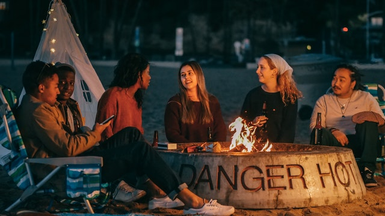
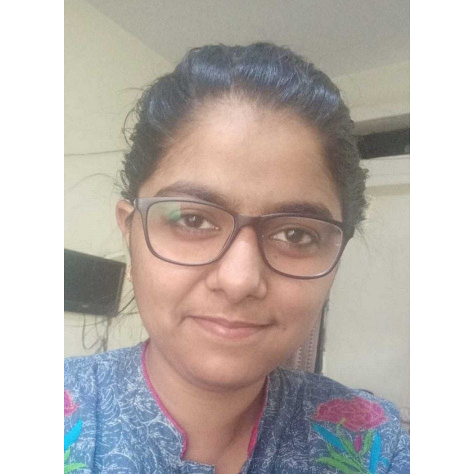
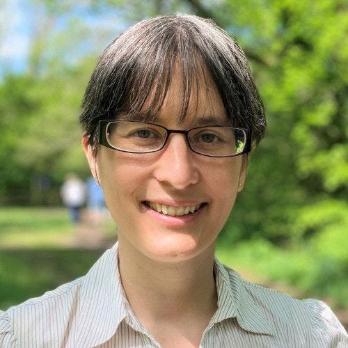
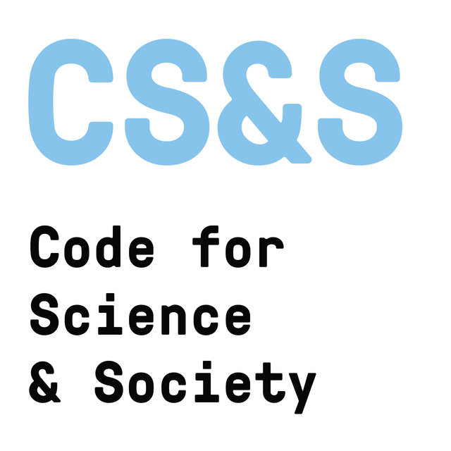

*Learn how to contribute to R!*

The Collaboration Campfires are online collaborative events to open pathways for members of groups currently underrepresented in the R project. The goal is to demystify the R development process and highlight ways that R programmers can contribute, with a focus on low-level contributions in terms of time commitment and prerequisite knowledge.

<center>

</center>

The current series is planned in the run-up to the useR! 2022 online conference, where we plan to hold a satellite global contribution event: the [Bug Barbecue](https://user2022.r-project.org/program/)!

## Schedule

The Collaboration Campfires will be on the 4th Tuesday of every month from February to May 2022. The 90 minute Zoom sessions will start at **15:30 UTC**. Note: many countries switch to daylight savings time either before the March meeting or before the April meeting.

 - **February 22**: Explore R's Bug-tracking Process [[local time](https://everytimezone.com/?t=62142780,3a2)]
 - **March 22**: How to Help Review R Bug Reports [[local time](https://everytimezone.com/?t=62391180,3a2)]
 - **April 26**: Explore R's Process for Localization (Translation) [[local time](https://everytimezone.com/?t=62673600,3a2)]
 - **May 24**: How to Contribute to a Translation Team [[local time](https://everytimezone.com/?t=628c2000,3a2)]
 
If you are a member of the [R-Ladies](https://rladies.org/), [MiR](https://mircommunity.com/), [ArabR](https://github.com/ARab-R), [AfricaR](https://africa-r.org/), [AsiaR](https://bit.ly/join_asiaR_slack), or [LatinR](https://latin-r.com/) communities, or otherwise identify as part of an underrepresented group among R contributors, then we especially encourage you to participate! 
Anyone from the general R community that respects and supports the aims of these events is also welcome to attend. 
 
Registration is **free**. Click the button to register for individual or multiple events and receive a calendar invite.

[[Zoom Registration Form]](https://us02web.zoom.us/meeting/register/tZ0qf-uqqjovE9RqD6hvjAIigS9nQb69WGRf)

If you have a friend or colleague who might be interested in attending the Collaboration Campfires, then why not invite them along!

## Campfire Hosts

```{=html}
<div class="grid mb-4">
  <div class="g-col-12 g-col-sm-6">
    <div class="card">
      
      <div class="card-body">
        <h3 class="card-title h5">Saranjeet Kaur</h3>
        <ul class="list-unstyled d-flex flex-wrap gap-4 mb-0">
          <li>
            <a href="https://twitter.com/qwertyquesting" target="_blank" rel="noopener noreferrer">
              <i class="bi bi-twitter-x" aria-hidden="true"></i> Twitter
            </a>
          </li>
          <li>
            <a href="https://saranjeetkaur.github.io/About-Me/" target="_blank" rel="noopener noreferrer">
              <i class="bi bi-globe" aria-hidden="true"></i> Website
            </a>
          </li>
        </ul>
      </div>
    </div>
  </div>
  <div class="g-col-12 g-col-sm-6">
    <div class="card">
      
      <div class="card-body">
        <h3 class="card-title h5">Heather Turner</h3>
        <ul class="list-unstyled d-flex flex-wrap gap-4 mb-0">
          <li>
            <a href="https://twitter.com/heathrturnr" target="_blank" rel="noopener noreferrer">
              <i class="bi bi-twitter-x" aria-hidden="true"></i> Twitter
            </a>
          </li>
          <li>
            <a href="https://warwick.ac.uk/fac/sci/statistics/staff/academic-research/turner" target="_blank" rel="noopener noreferrer">
              <i class="bi bi-globe" aria-hidden="true"></i> Website
            </a>
          </li>
        </ul>
      </div>
    </div>
  </div>
</div>
```

If you have any questions about the events, please contact [heather@r-project.org](mailto:heather@r-project.org) or find us on the R Contributors Slack.

## Organizers and partners

The Collaboration Campfires are part of the project [Building Community around the R Development Guide](https://incubator.codeforscience.org/cohort), supported by the Digital Infrastructure Incubator at [Code for Science & Society (CS&S)](https://codeforscience.org/). The project is led by Saranjeet Kaur Bhogal and Heather Turner, and mentored by [Rayya El Zein](https://www.rayyasunayma.com/). Members of partner communities and the R Contribution Working Group have contributed to the organisation, and will provide expert and peer support during the sessions.

## Code of Conduct

As CS&S events, their [code of conduct](Guidelines for community participation & Code of Conduct: (https://eventfund.codeforscience.org/code-of-conduct/) will apply to these sessions.

<center>
<a href = "https://codeforscience.org/">

</a>
</center>
