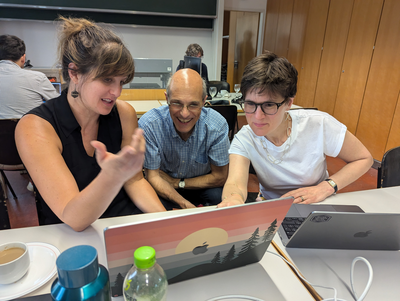

# R Dev Days

R Dev Days are short events - usually over one day, or linked sessions over 
consecutive days - for novice and experienced contributors to work 
collaboratively on contributions to base R. These events have the support of 
the R Core Team and some will have R Core Developers participating directly.

## Upcoming events

These are the planned events for 2025 - events that are tentative are shown in italics
Links to the registration/application page and the corresponding deadline will be added as soon as these details are available.

|          Satellite to         |       Where      | Date |   Deadline  |
|:-----------------------------:|:----------------:|:-------------:|:---------:|
| [Rencontres R 2025 (19-21 May)](https://pretix.eu/r-contributors/r-dev-day-rr2025/) | Mons, Belgium    | Thu 22 May  | Fri 18 Apr |
| [useR! 2025 (8-10 Aug)](https://user2025.r-project.org/additional/r-dev-day)         | Durham, NC, USA  | Mon 11 Aug    | Tue 15 Apr |
| [RSECon25 (9-11 Sep)](https://warwick.ac.uk/fac/sci/statistics/news/r-dev-day-rsecon25) | Warwick, UK      | Fri 12 Sep    | Wed 23 Apr |
| _posit::conf (16-18 Sep)_       | _Atlanta, GA, USA_ | _Fri 19 Sep_    | _TBA_ |
| [Shiny in Production (8-9 Oct)](https://pretix.eu/r-contributors/r-dev-day-sip-2025/) | Newcastle, UK    | 7-8 Oct       | Wed 24 Sep |

## What happens at an R Dev Day?

Tasks are prepared in the run-up to the event, but commonly include:

 * Reviewing, analysing and fixing code or documentation bugs reported on R’s [Bugzilla](https://bugs.r-project.org/).
 * Contributing to message translations via [Weblate](https://translate.rx.studio/projects/r-project/).

Tasks may also relate to contributor infrastructure, such as the 
[R Dev Guide](../rdevguide) and the [R Dev Container](../r-dev-container).

## Who can take part?

Some events have open registration, whilst others have an application process 
to ensure a balance of experience levels over limited places.

R Dev Days are usually run as satellite events to a conference, with 
registration/application open to people outside the conference.

The main criteria for participation is a good knowledge of R programming and a 
keen interest in contributing, as we hope participants continue to contribute 
after the event. 

## How much does it cost?

R Dev Days are free to attend and we are usually able to provide lunch and 
refreshments to particpants. We will advertise when additional support is 
available (e.g. through scholarships to the associated conference).

Each event will have a ticket site or web page with more information - see the 
[Upcoming events](#upcoming-events) section or the 
[R Contributor Events Page](..).

## Past R Dev Days

2024

[Imperial 2024](https://pretix.eu/r-contributors/r-dev-day-imperial-2024/) (satellite to London satRday) ([report](https://github.com/r-devel/r-dev-day/blob/main/reports/2024-04_imperial2024.md))  
[PLUS 2024](https://contributor.r-project.org/r-dev-day-plus-2024/) (satellite to useR! 2024) ([report](https://github.com/r-devel/r-dev-day/blob/main/reports/2024-07_plus2024/plus2024.md))  
[Hutch 2024](https://pretix.eu/r-contributors/r-dev-day-hutch-2024/) (satllite to posit::conf(2024)) ([report](https://github.com/r-devel/r-dev-day/blob/main/reports/2024-08_hutch2024.md))  
[SIP 2024](https://pretix.eu/r-contributors/r-dev-day-sip-2024/) ([report](https://github.com/r-devel/r-dev-day/blob/main/reports/2024-10_sip2024/sip2024.md))  
[RSECon 2024](https://virtual.oxfordabstracts.com/event/49081/submission/168) ([report](https://github.com/r-devel/r-dev-day/blob/main/reports/2024-09_RSECon24.md))  
[LatinR 2024](https://pretix.eu/r-contributors/r-dev-day-latinr2024/) ([report](https://github.com/r-devel/r-dev-day/blob/main/reports/2024-11-18_LatinR2025.md))

